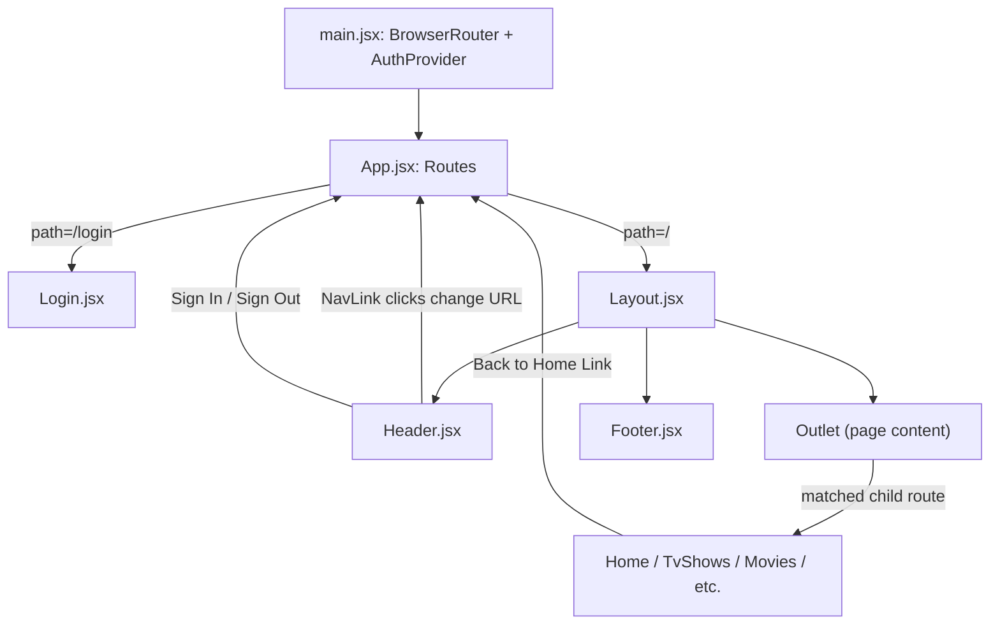

# Routing Flow

```mermaid
flowchart TD
    A[main.jsx: BrowserRouter + AuthProvider] --> B[App.jsx: Routes]
    B -->|path=/login| L[Login.jsx]
    B -->|path=/| C[Layout.jsx]
    C --> D[Header.jsx]
    C --> E["Outlet (page content)"]
    C --> F[Footer.jsx]
    D -->|NavLink clicks change URL| B
    D -->|Sign In / Sign Out| B
    E -->|matched child route| G[Home / TvShows / Movies / etc.]
    G -->|Back to Home Link| B
```
